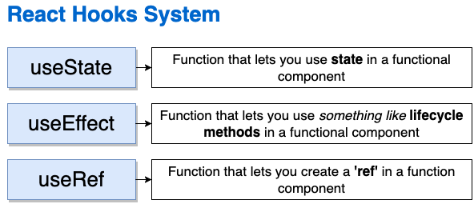
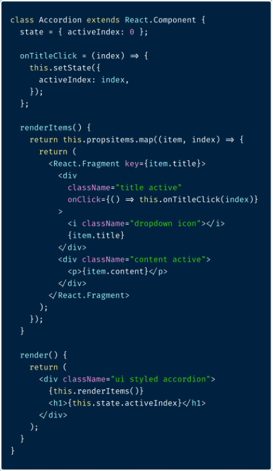
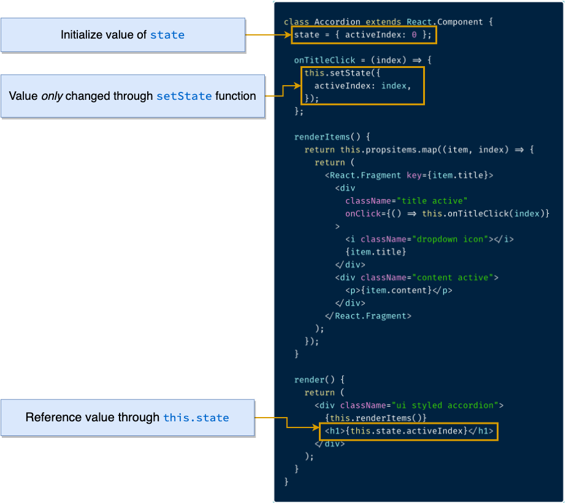
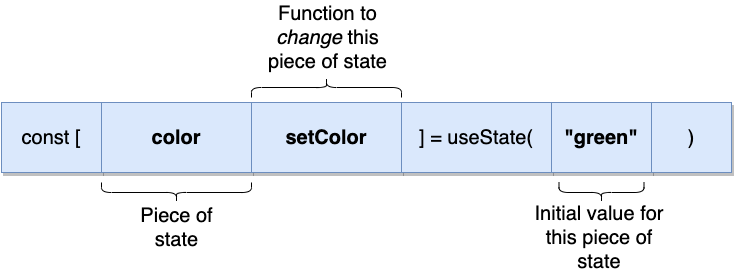
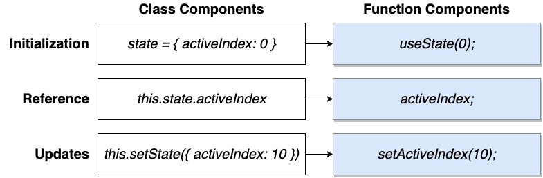
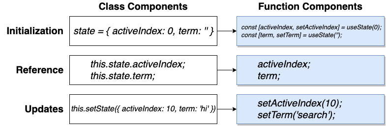

# The useState hook

Here are the most important hooks in React




## setState in Class Components


<br>
<br>

<br>


## The useState hook in Functional Components




## State management in Class vs Functional Components




## For setting multiple items in the state




## Secret behind the syntax of useState hook (array destructuring)

```js
const [color, setColor] = useState("green");
```

The `useState` hook always returns an array with exactly 2 elements.

Above syntax is a shorthand form of below code:

```js
const things = useState("green");
const color = things[0];
const setColor = things[1];
```

## Setter Functions

```js
const [activeIndex, setActiveIndex] = useState(null); // initialise to null

const onTitleClick = (index) => {
  setActiveIndex(index);
};
```

As soon as we call any setter function coming from the useState hook, our entire component is going to re-render.

When the component gets re-rendered, the default initialisation value will not be used anymore.

The value passed in the setter function will be used instead (just like traditional `for-loop`).
