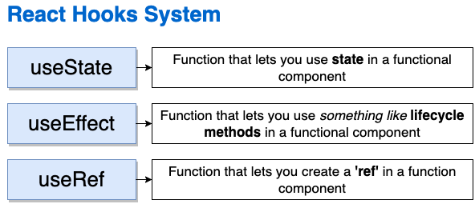
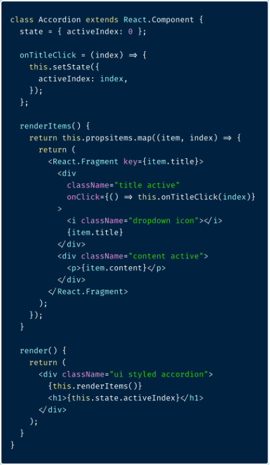
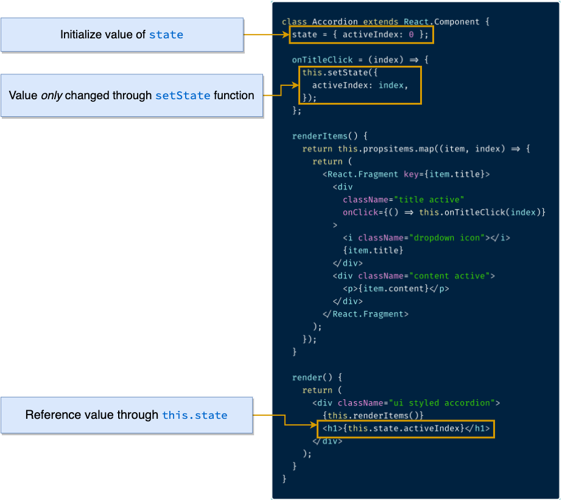
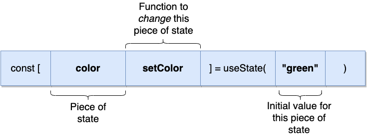
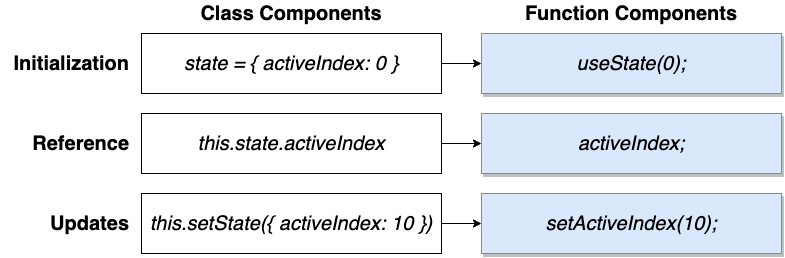
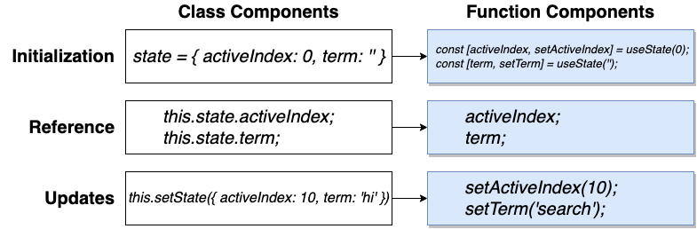

# The useState hook

Here are the most important hooks in React

## setState in Class Components

 
 

 

## The useState hook in Functional Components

## State management in Class vs Functional Components

## For setting multiple items in the state

